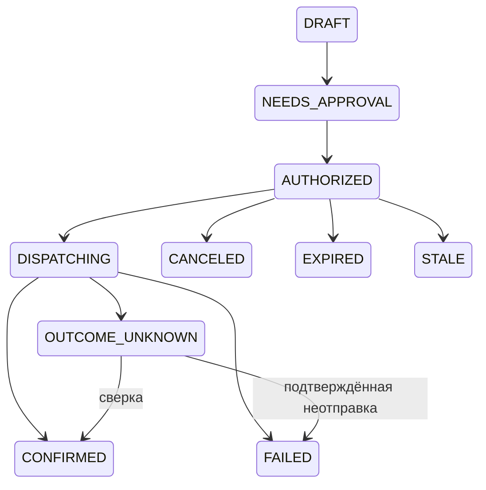

# Внешние действия и полномочия

Проектный контракт для будущих отправок. Наличие аккаунта, принятие плана и разрешение конкретного действия — разные состояния.

Approval связывает owner, account, connector, action kind, target, payload hash, attachment hashes, profile/plan version, expiry и одноразовый nonce. Пользователь видит именно отправляемые существенные данные. Изменение CV, адресата или ответа аннулирует старое approval.

Перед dispatch сервер повторно проверяет владельца, версии, expiry и отзыв. Резервирование локальной попытки и постановка в очередь атомарны. Внешний executor получает только необходимые данные конкретного действия.

Локальная идемпотентность не гарантирует exactly-once на чужом сайте. Если submit мог пройти, а ответ потерян, сохраняется OUTCOME_UNKNOWN; сначала сверка, затем решение о дальнейшей попытке. Revoke блокирует ещё не отправленные действия, но не отменяет уже принятый отклик.

Мандат L4 ограничивает provider, виды действий, роли, географию, факты профиля, количество, бюджет, срок и исключения. Он вводится после shadow и подтверждённых единичных действий. Модель не расширяет мандат и не подтверждает собственный выход за границы.

Текст вакансии, страницы или чека — недоверенные данные. Встроенная инструкция не выдаёт scopes и не разрешает отправить выписку. Финансовое положение не включается в отклик работодателю.
