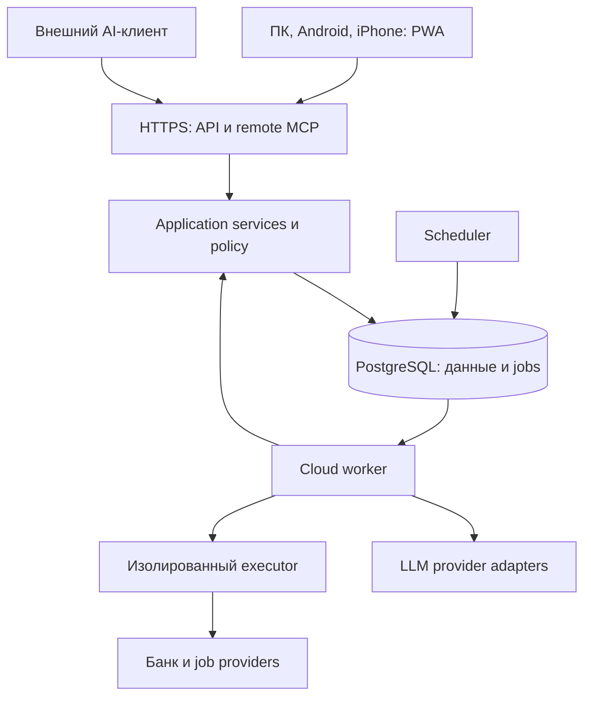

# Облачная архитектура

Статус: действующий технический проект cloud-first; alpha-код существует, deployment ещё не выполнен. Ниже целевая архитектура; отличия текущего среза перечислены в [IMPLEMENTATION](IMPLEMENTATION.md). [ADR-0001](adr/0001-runtime-shape.md) фиксирует выбор по текущему поручению владельца.

## Граница продукта

MOZHNA работает в облаке. Браузер/PWA, мобильная оболочка и MCP-клиент — способы доступа к одному backend. Денежная истина, планы, разрешения, задачи и результаты принадлежат облачному состоянию, а не памяти телефона или сессии модели.

Банк допускает только чтение; внешние записи нужны позже для разрешённых job actions. Executor пишет ограниченный receipt через внутренний интерфейс, а не через полный доступ к базе.

## Процессы

| Процесс | Работа | Состояние |
| --- | --- | --- |
| API | UI REST, remote MCP, trusted approvals, webhooks, чтение job status | Stateless между запросами; долговечные данные в PostgreSQL |
| Worker | Импорт, OCR/LLM, альтернативы, поиск, результаты | Lease/checkpoints в БД; потеря процесса не теряет команду |
| Scheduler | Перевод due schedules в уникальные jobs | Schedule и next_due_at в БД, блокировка от дублей |
| Executor, с внешними действиями | Один типизированный dispatch и проверка receipt | Изолированные secrets/egress и минимальный контракт результата |

API/worker/scheduler используют **один Python backend image**, но запускаются отдельно. Money, evidence, plans, actions, connections, model_providers и jobs — внутренние модули. Чистое Money Kernel живёт в backend domain; packages не дублирует формулы.

PostgreSQL — канонические данные, transactional outbox и jobs. Object storage — приватные файлы. Диск контейнера используется только временно.

## Вход и идентичность

Web: OIDC Authorization Code, серверная сессия в Secure/HttpOnly cookie, CSRF-защита для записи. API обслуживает frontend и `/api/v1` под одним origin в первом deployment: production React assets входят в image. Это сокращает cross-origin конфигурацию; публичные versioned assets позднее можно вынести в CDN.

Remote MCP: отдельный resource-scoped OAuth access token и scopes; web session cookie не принимается как универсальный MCP credential. Authorization server выбирается и проверяется в C0; обычный OIDC login ещё не доказывает совместимость MCP OAuth.

Owner/workspace определяется проверенной identity. UI/API/MCP/worker вызывают одинаковые application services; каждая команда повторно проверяет разрешения, включая действие по сохранённому мандату.

## Два пути к моделям

**Cloud inference:** worker вызывает настроенный provider через ModelProvider. Закрытый браузер не мешает задаче. Нужны разрешённый API/self-hosted endpoint и бюджет.

**External harness:** ChatGPT/Claude Code/другой совместимый клиент вызывает remote MCP MOZHNA. Он может дать предложение или поставить разрешённую задачу в облачную очередь. Наличие MCP не означает, что MOZHNA умеет запускать подписочную модель самостоятельно.

Если задача привязана к внешнему исполнителю и тот отключён — WAITING_EXECUTOR. Если настроен cloud provider — работа продолжается в облаке. Условия inference и доступность client capabilities проверяются при подключении.

## Контракты

Pydantic — источник REST OpenAPI и JSON Schema domain-команд. TypeScript client генерируется; несовместимые изменения проходят contract diff. Money на JSON-проводе — integer minor units в диапазоне безопасных JS integers; сервер отвергает значения вне диапазона, а не округляет их.

MCP/LLM provider protocol не хранит продуктовый план: новый клиент или модель получает canonical snapshot, plan version и разрешённый следующий шаг. Detected capabilities выбирают доступную форму ответа и способ ввода; не меняют финансовую политику и scopes.

Подробности: [CLOUD_EXECUTION](CLOUD_EXECUTION.md), [LLM_ADAPTERS](LLM_ADAPTERS.md), [CLIENTS](CLIENTS.md), [DEPLOYMENT](DEPLOYMENT.md).
